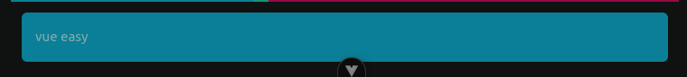

# 主教程

## S0: 编码规范

文件夹全部用小写字母
每个界面文件夹都有一个assets文件夹存放资源，引用时使用`./assets/xxxxxxx`(仅限与assets文件夹同级的vue代码文件)

在css块上一定要加上**scoped**

```vue
<style scoped>
/**
 * 这里写CSS
 */
</style>
```

## S1: 和HTML很像

### 在**template**编写简单的HTML代码

例如

```vue
<template>
  <div>
    <main>
      <h1>home</h1>
      
    </main>
  </div>
</template>
```

你可以用h1, h2, h3

#### img

```vue

```

显示图片


#### 横向布局

在**template**中

```vue
<div id="row1">
    <h1>H1</h1>
    <h2>H2</h2>
</div>
```

在**style scoped**中

```vue
#row1 { display: flex; }
```

如图所示


## CSS装饰

### 横向布局的原理

你应该有观察到横向布局中在**div**设置了id属性

```vue
<div id="row1">
    <h1>H1</h1>
    <h2>H2</h2>
</div>
```

在**style scoped**中就可以使用

```vue
#row1 { display: flex; }
```

其中row1是你定义给你写的div的id属性
语法是《#**你定义的组件id**》
而里面的大括号是你给这个组件修饰的CSS代码，以后就称他为**这个组件的CSS块**

### 这里就来一段测试代码

```vue
      <div>
        <h1 id="title1">标题1</h1>
        <div id="content1">
          <h2 id="c1">内容1</h2>
        </div>
        <h1 id="title2">标题2</h1>
        <div id="content2">
          <h2 id="c2">内容2</h2>
        </div>
      </div>
```

### 文字颜色

如果我想该标题1,2的文本颜色，那就在它的CSS代码块中

```vue
#title1 { color: aqua; } #title2 { color: brown; }
```


### 内容背景

```vue
#content1 { background-color: blue; } #content2 { background-color: greenyellow; }
```


### 说实话，颜色确实不好看

所以我推荐一个配色网站: <https://coolors.co/palettes/trending>
里面所有的颜色点击就可以复制，但在引用时需要前面加上“#”如“#7209b7”
将文字和内容背景换成好看的：

```vue
#title1 { color: #f72585; } #content1 { background-color: #06d6a0; } #title2 { color: #00b4d8; }
#content2 { background-color: #8f2d56; }
```


### 调整大小

使用

```vue
#content1 { background-color: #06d6a0; width: fit-content; height: 250px; }
```

可以调整content1的大小

以下的所有属性都可以用在**width**, **height**

#### fit-content

用于让组件处以一种刚刚好的大小
比如content1在没有设置`width: fit-content;`时，宽度远远超出它所需

#### 多少px

px是像素单位， 例如在1080P中， 横向px就是1920px, 竖向是1080px

#### 百分比

看看下面的代码

```vue
#content2 { width: 50%; }
```

使content2的宽度刚好占屏幕的50%（这样说可能有点不恰当，应该说宽度占父组件的50%）

#### 自动填充剩余空间（不能直接放width,height中，它是一个单独的属性）

先把界面写好（div中必须放内容，不然不会显示）

```vue
<div id="row2">
  <div id="r1">12</div>
  <div id="r2">11</div>
</div>
```

对应的**CSS块**：

```vue
#row2 { display: flex; } #r1 { background-color: #00b4d8; } #r2 { background-color: #06d6a0;
flex-grow: 1; }
```

我让**row2**为横向布局，**r1**和**r2**设置不同背景，这样比较容易突出**flex-grow**属性的特点
注意看这里的关键是**flex-grow**属性！
**r1**没有flex-grow属性，**r2**有，结果如下

**r1**只占了刚好够它用的空间，**r2**将剩余空间填满了
它的原理是**flex-grow**属性会将同一层级的所有组件计算一次大小，读取每个组件的**flex-grow**属性（如果组件没有这个属性就跳过）相加起来计作total,
将那些没有**flex-grow**属性的组件保持原始大小不变，有**flex-grow**的组件将会根据它的属性值与**total**的比值来分配空间（听不懂没事，用久了就懂了）
再给你举个例子加深一下：
先把界面写好(实际上就是多添加一个**r3**)：

```vue
<div id="row2">
  <div id="r1">12</div>
  <div id="r2">11</div>
  <div id="r3">KHFS</div>
</div>
```

还有CSS块(这就有点不一样了):

```vue
#row2 { display: flex; } #r1 { background-color: #00b4d8; flex-grow: 3; } #r2 { background-color:
#06d6a0; } #r3 { background-color: #f72585; flex-grow: 5; }
```

如图所示

**r1**的flex-grow是3
**r2**没有flex-grow，所以保持原始大小
**r3**的flex-grow是5

### 圆角

使用**border-radius**属性
先把界面写好()：

```vue
<div id="x1">vue easy</div>
```

对应的CSS块：

```vue
#x1 { background-color: #00b4d8; border-radius: 6px; height: 55px; }
```

效果


**border-radius: 6px;**是调整圆角弧度的

### 外边距

对上面圆角的例子改造一下
对应的CSS块：

```vue
#x1 { background-color: #00b4d8; border-radius: 6px; height: 55px; margin: 12px; }
```

可以看到，它距离其他组件有一定的距离了


`margin: 12px;`中的px值可以根据需求改大改小

### 内边距

继续改造
对应的CSS块：

```vue
#x1 { background-color: #00b4d8; border-radius: 6px; height: 55px; margin: 12px; padding: 15px; }
```

文字几乎要居中了

`padding: 15px;`中的px值可以根据需求改大改小

最后给你们指条明路：<https://developer.mozilla.org/zh-CN/docs/Learn/CSS/First_steps>

About界面比较整洁，你们可以任意修改，测试：**src/views/about/AboutView.vue**
